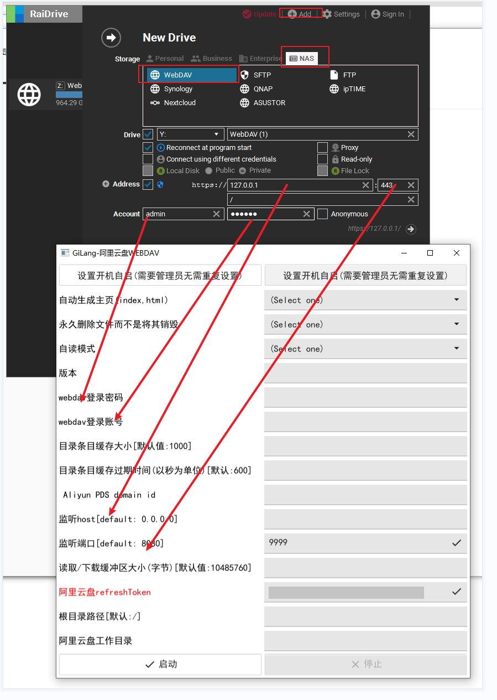
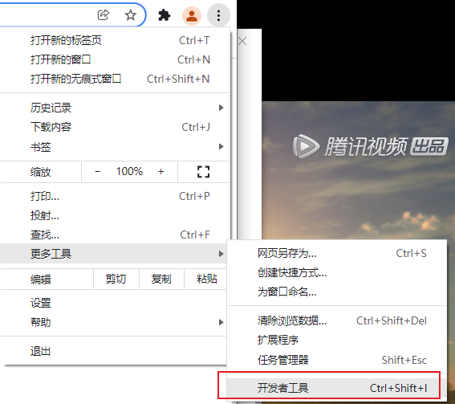
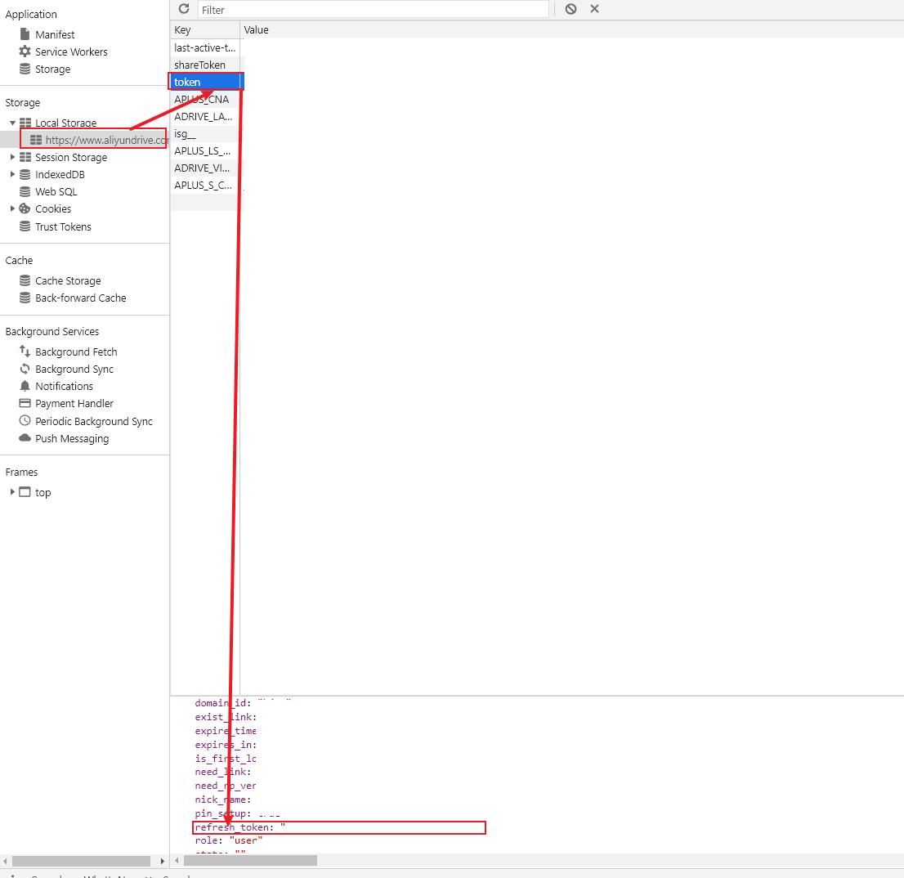
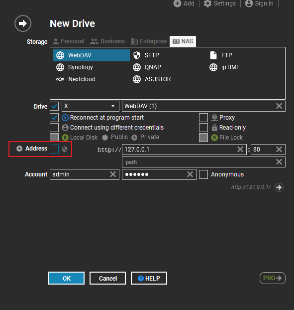
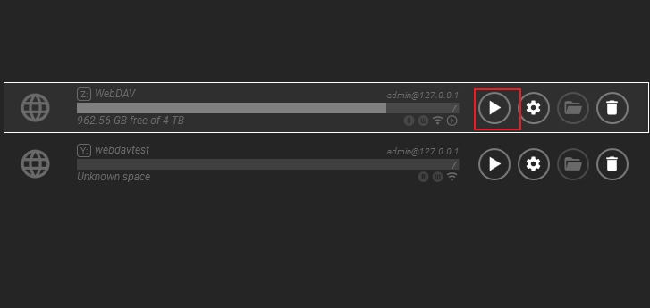
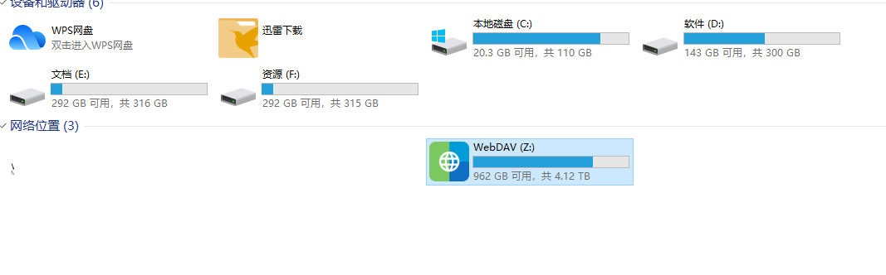

# aliyundriver-webdav 
# 好用请点个star吧
#### 介绍
{**阿里云盘/本地挂载网络盘/WebDAV/win软件/界面**}

#### 软件架构
https:fyne.io/fyne/v2 v2.1.2 ui框架

https:github.com/getlantern/systray 任务栏(win10 bug不少 弃用)

https:github.com/gookit/goutil (工具类)

https://github.com/messense/aliyundrive-webdav (一个rust写的webdav)

#### 安装教程(界面存在一定偏差)

下载压缩包 可以直接运行 aliyundriver-webdav.exe

关于开机自启 需要RaiDrive 和 webdav服务开机自启, webdav设置自启可能需要管理员权限

#### 使用说明

# 安装RaiDrive

文件在指南目录下, 你也可以自行下载

配置

**最简单只需要填 refreshToken( 建议改端口 防止被占用)**

`注意, 把地址Address去掉 不使用https`

# 获取refreshToken

> **1. 登录阿里云**
>
> https://www.aliyundrive.com/
>
> 2. 浏览器打开**开发者模式(F12)**
>
> 
>
> 3. **获取refreshToken**
>    

## 配置RaiDrive

`注意, 把地址Address去掉 不使用https`

# 启动Raidrive服务

# 查看是否生效

# 没有生效

查看日志文件/logs(还没完善 有问题请联系)

# 常见问题

> refresh_token
>
> > 每次启动程序会刷新refresh_token, webdav启动的时候 refresh_token会刷新, 当前简单实现, 只在程序启动获取刷新后的refresh_tokenUI显示, 当自动刷新的refresh_token发生变更, 手填的会被覆盖
> >
> > refreshToken长度只有36位数字英文组成
>
> 关于程序启动问题
>
> > 管理员启动webdav程序, 需要管理权限关闭
> >
> > 设置开机自启需要使用管理员权限
> >
> > 启动webdav服务后可以退出本程序, 不需要一直启动
>
> 程序配置
>
> > 红色必填
> >
> > 绿色建议
> >
> > 灰色可选

## 有问题可以微信联系

#### 参与贡献

1. Fork 本仓库
2. 新建 Feat_xxx 分支
3. 提交代码
4. 新建 Pull Request

5. https://gitee.com/gitee-stars/)

##免责声明
- 本软件服务于阿里云盘，旨在让阿里云盘功能更强大。如有侵权，请与我联系，会及时处理。
- 本软件皆调用官方接口实现，无任何“Hack”行为，无破坏官方接口行为。
- 本软件仅做流量转发，不拦截、存储、篡改任何用户数据。
- 严禁使用本软件进行盈利、损坏官方、散落任何违法信息等行为。
- 本软件不作任何稳定性的承诺，如因使用本软件导致的文件丢失、文件破坏等意外情况，均与本软件无关。
